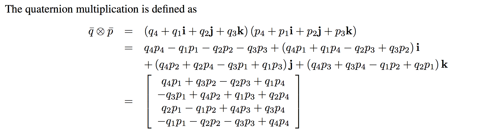
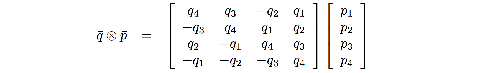
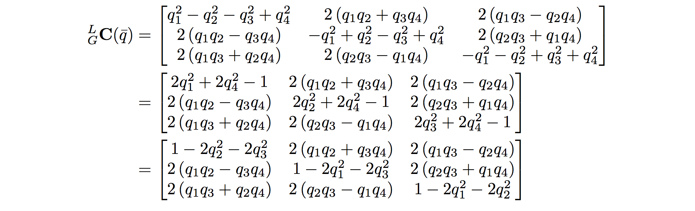

# 졸업 프로젝트

## 3월 4일
목표를 정하다: 이번 졸업 프로젝트의 목표로 6-DoF camera pose를 5개 정도의 연속된 사진을 넣어서 마지막 사진 혹은 첫번째 사진을 제외한 4개의 사진의 6-DoF camera pose를 구하는 CNN + RNN 구조의 Neural Network를 만들고자 한다. 

목표의 이유: Self Localization은 컴퓨터 비전에서 매우 중요한 문제이며, 움직이는 로봇이나 네비게이션, 증강 현실등에서 사용된다. 이것을 Learning problem으로써 해결한다는 의의가 존재한다.

PoseNet으로 부터 많은 intuition을 얻었고, DeMoN은 learning schedule이나 네트워크로 normal, depth, optical flow, 6-DoF camera pose를 모두 구하기 때문에 너무 복잡하다고 생각되어 (또한 쓸모없는 것들이 너무 들어간다 생각되어), 6-DoF camera pose만을 구하는 문제로 접근하기로 하였다.

### PoseNet
PoseNet은 하나의  Scene 혹은 Landmark를 정하여, 그 Landmark를 찍은 비디오로부터 뽑은 프레임과 각각 프레임에 해당하는 6-DoF camera pose (고전적인 컴퓨터 비전 방법으로 구하였다)을 target으로 하는 training set으로 만들어 Convolution Neural Network를 training 시킨다. 그 후 그 Landmark를 찍은 임의의 사진을 CNN에 input으로 넣으면 output으로 그 사진을 찍은 camera의 6-DoF camera pose를 내놓는다. 이 때 CNN은 ImageNet dataset을 사용하여 classification 문제를 해결하도록 pretrained 된 GoogleNet을 사용하였다.

**Transfer Learning:** GoogleNet은 분명 classification 문제를 해결하도록 pretrained 되어 있었지만, softmax classifier를 제거하고, (1024, 2048), (2048, 7) 두 개의 fully connected layer를 붙임으로써 pose를 regression하는 훌륭한  regressor가 되었다. 즉 classification이 pose를 regression하는 문제를 풀기위한 시작점으로 적절한지는 obvious하지 않으나, pose에 상관없이 classification하기 위해 classifier network가 pose를 tracking 해야 한다는 possible explanation이 있다고 저자들은 설명 한다. 나 또한 이것이 일리가 있다고 보며, 실제로 꽤나 좋은 성능을 보여주었다. 최근 실험 결과는 마지막 fully connected 전에 LSTM을 사용함으로써 state-of-art의 결과에 꽤나 접근했다.

**그러나**, PoseNet은 한 Network가  한 Scene (Landmark) 밖에 배우지 못하며, relocalization 문제 밖에 풀지 못해, 실제 SLAM을 대체 할수 없다. 저자들은 finite neural network가 learning을 통해 localize할 수 있는 physical area는 한계가 있는게 분명 하다고 주장한다.

그렇다면 physical area를 배우는게 아니라 여러장의 프레임이 들어왔을 때 첫번째 사진에 대한 camera pose를 구하게 하는 문제로 바꿔보면 어떨까? 이 문제가 충분히 가능하다고 생각되는 이유는 다음과 같다.

위의 그림을 보면 알 수 있듯이, Place dataset (Scene classification dataset)만을 learning시킨 GoogleNet의 feature vector도 (마지막 softmax classifier 들어가긴 전 feature vector라고 예상됨) 시간대 별로 clustering되어있다는 점에서 CNN자체가 pose정보를 가지고 있다는 것을 알 수 있다. 또한 다른 지역을 learning 시킨 PoseNet도 (1024, 2048) fully connected layer를 통과한 feature vector가  매우 잘 정렬 되어있다는 점에서 마지막 pose prediction layer가 해당 scene에 overfitting되어 있어서 그렇지 그 전 feature는
frame별 pose의 정보를 매우 잘 표현할 수 있다고 본다. 즉 마지막 prediction layer를 scene에 overfitting 시키지 않고, 첫 번째 사진에 대해서만 pose를 뽑게 한다면 충분히 generalization 될 수 있지 않을까? 물론 해봐야 알겠지만...

### RNN
이런 6-DoF camera pose도 카메라가 시간에 따라 움직인 pose를 구한다는 점에서 spatio-temporal problem이다. 이런  spatio-temporal problem의 예로 video captioning이나 video action classification등이 있는데, 이런 문제들은 3D-Convolution이나, RNN을 같이 사용함으로써 많은 성과를 이뤄냈다. 여기서 사용한 방법들을 사용하면, 내가 풀고자 하는 문제도 도움을 얻을 수 있을 것이라 생각하였다. 

* 3D-Convolution (이하 C3D)는 transfer learning을 하기에는 적합하지 않다고 생각하여 (사실 제대로 생각 안해봄) 제외 하였지만, 지금 C3D가 video captioning에서 state-of-art에 있으므로 C3D의 사용도 생각해 보아야 한다. 논문도 아직 안읽어봄, 논문을 어서 읽자.
* GRU-RCN, convolution filter를 GRU의 weight들로 사용하자는 획기적인 방법이다. 그러나 너무 많은 parameter가 존재하여, 적은 training set으로 learning시키기에는 무리가 있어보이며, VGG-RNN에 비해 그렇게 차이나는 성능을 내지는 못한다.
* VGG-RNN, ConvNet으로 feature를 뽑고 마지막 feature을 RNN에 feeding한다. 이는 Video Capitioning Problem에서 매우 좋은 성능을 냈으며, (관련 논문 읽어 볼것!) slow fusion이나, late fusion같은 3D-Convolution들 보다도 월등한 성능을 보여줬다. 또한 구현도 그리 어렵지 않아 보인다. 이 구조를 base-line으로 삼아 우선 빨리 구현해 본다음에 성능을 보자. 물론 이 구조도 hyper-parameter들이 많이 존재하고(LSTM, GRU, pure RNN, 혹은 many-to-many, many-to-one등) 아직 RNN을 잘 이해하지 못하였지만 **창현씨** 말대로 빨리 구현해서 성능을 보는게 중요하다고 생각된다. 

### 우선순위
1. Res-Pose-Net 구현해서 성능 한번 볼것! dataset 만드는 연습도 될듯
2. Res-RNN을 빨리 구현해서 성능을 빨리 볼것 
3. 매일 매일 관련논문 한편씩 읽을것!!
4. 생각을 잘 정리해 둘것!

## 3월 7일
### C3D - Learning Spatiotemporal Features with 3D Convolution Networks
C3D는 일반적인 ConvNet과 다르게 input으로 여러 frame을 넣으며, kernel또한 time dimension이 존재한다. C3D는 `3 x 3 x 3` 짜리 homogenous한 convolution kernel을 사용했으며 (물론 channel depth가 따로 존재한다) 여러 벤치마크 (action recognition, sports classification 등등) 에서 state-of-art의 결과를 보여주었다. 저자들은 2D Convolution에 비해 C3D는 Spatiotemporal feature를 배우기에 더 적합하다고 주장한다. 또한 앞서 벤치마크 결과들은 별도의 fine-tuning없이 이뤄진 것으로 C3D의 feature가 매우 의미있는 feature이고 이 feature들은 video의 object, scene, action 정보를 담고 있다고 주장한다. 또한 소스코드와 100만개의 sports video를 통해  **pre-trained**된 model이 존재한다.

2D ConvNet은 오직 spatially convolution함으로 temporal information을 잃어버린다. 그러나 3D ConvNet은 spatio-temoporally convolution을 하기 때문에 temporal information을 modeling할 수 있다. 16개의 frame을 input으로 넣어서 training 시켰다. 이렇게 training된 C3DNet을 feature extractor로도 사용할 수 있는데 fc6의 activation을 feature로 사용하였다.

**Action Recognition**의 경우 iDT를 같이 썼을 때 성능이 5%이상 증가하였다. iDT가 low-level gradient와 optical flow를 가지고 있고, C3D는 high level abstract/semantic information을 capture하기 때문에 서로 상보적이라 이런 성능 증가가 있는 것이라고 예측하였다. 결국 C3D도 optical flow를 완벽하게 포함하고 있는것은 아니다. DeMoN에서 optical flow를 중간에 넣어논 것도 optical flow를 추가하면 대부분의 Network들이 성능 증가를 보였고, Network가 optical flow를 내재적으로 알아서 배우기 힘들기 때문일 것이다.

**Scene and Object Recognition**의 경우 scene classification은 매우 잘하였지만, object recognition은 좋은 성능은 내지 못하였다. 그 이유는 sports에 대하여 pre-trained되어 있었기 때문에 object에는 좀 약하기 때문이고, C3D는 video안에서 물체가 어떻게 움직이는지 알아내도록 training되어있지, 1인칭 시점으로 camera가 직접 움직이면서 찍는 video로 training되어 있지 않아서이다. 즉, 1인칭 시점으로 camera가 움직이면서 찍는 video와 카메라가 움직이는 물체를 찍는 video는 그 motion characteristic이 매우 다르기 때문.

**C3D**는 많은 벤치마크에서 state-of-art의 성능을 보였는데, 중간에 fusion을 없앴기 때문에 temporal information을 마지막 fully connected layer까지 유지하기 때문일 것이다. 또한 fc6의 activation은 매우 훌륭한 feature로 쓰였고, sports classfication이 아닌 다른 문제에도 transfer-learning을 통해 state-of-art의 성능을 보여주었으며, pre-trained되 model도 공개 되어있다 (다만 caffe model임). 그러나 pre-trained에 사용된  dataset이 화면안에서 물체가 움직이는 video들이 대부분이라, 내가 목표로하는 카메라가 움직일 때 카메라의 6-DoF를 찾는 문제에는 완벽하게 적합하다고는 할 수가 없다. 또한 input으로 16 frame정도의 연속된 사진을 원하는데, 현재 dataset의 경우 16 frame이면 마지막 frame이 첫번째 frame으로 부터 너무 멀어서  learning이 잘 안될 수도 있겠다는 생각이 들었다. Dataset이 적어서 scratch부터 training할 수는 없으므로, 최후의 방법으로나 사용하게 될것 같다. 

## 3월 8일
### Bayesian PoseNet - Modelling Uncertainty in Deep Learning for Camera Relocalization
PoseNet 저자가 쓴 논문으로 GoogleNet 중간에 Dropout layer를 넣어 Bayesian convolutional layer로 만들고 input image를 crop하여 여러개 집어넣은 후에 결과들을 averaging하면 기존 PoseNet보다 더 좋은 결과가 나온다고 한다. Bayesian이나 Bernoulli distribution 같은 모르는 내용이 많아 논문을 정확하게 이해하지는 못하였다. 그러나 결국 그들의 주장은 Dropout을 추가함으로써 Bayesian ConvNet을 만들 수 있고, Dropout을 통해 sampling 하는것은 model의 posterior distribution으로 부터 sampling하는 것이라고 볼 수 있다는 것이다. Test time에 Dropout Network로 부터 얻은 sample들을 averaging 함으로써 inference를 수행할 수 있고, 더 좋은 결과를 얻을 수 있다. sample들의 variance를 uncertainty로 추정하였다 (정확히는 trace of the unimodal Gaussian's covariance matrix). 실제로 uncertainty와 relocalization error는 비례관계 있었다.

그러나 이 논문으로 부터는 큰 intuition을 얻지 못하였다. 성능도 마지막에 LSTM을 붙인 논문이 더 좋았으며, 모든 Convolution layer이후마다 Dropout을 붙인 Network는 기존 PoseNet보다도 성능이 떨어졌기 때문이다 (그래서 저자는 하나의 convolution layer뒤에다 Dropout layer를 붙였고, regressor부분에 붙였다). 그 이유는 pre-trained된 Network의 feature들이 연약하게 (co-adapt) 융합 되어 있을수 있으며, 이들을 transferring하는 것은 이러한 상호 적응을 깨뜨릴 수 있기 때문에, 모든 layer뒤에 Dropout을 추가시키는 것은 Dropout없이 learning된 Network를 망가뜨릴 수 있다는 것이다.

그러나 내가 추가할 부분 (마지막 regressor 부분)에 Dropout을 추가하는 것은 적은 training set을 가졌을 때 매우 좋은 regularization 테크닉인건 분명 하므로, 나도 사용하는게 좋을 것이다.

## 3월 11일
### Implement PoseNet 
PoseNet을 구현하였다. 처음에는 뒤의 fully connect만 learning 하는 줄 알았다. Fully connect만 learning한 경우 Translation error: 9.60 (m), Rotation error: 9.31 (degree)가 나와 논문 보다 훨씬 안좋은 결과를 얻었다. 또한 fully connect layer의 weight initialization이 매우 중요했다. He initialization은 std가 너무 커서 loss가 divergence해버렸고, 논문의 구현을 따를 경우 loss를 convergence 시킬 수 있었다. regression의 경우 initialization을 어떻게 해야할지 좀더 고려해봐야 할 듯 하다.

Pre-trained된 ResNet까지 training 시켰을 때 152 layer ResNet은 parameter가 너무 많아서 batch size를 32정도 까지 줄여야만 했었다. 신기한건 training 때보다, validate일때 batch size를 더 줄여야 한다는 점이었다. 이해가 안간다. 

* Res-152 layer - 32 batch size, Translation error: 1.6 (m), Rotation error: 2.4 (degree)
* Res-34 layer - 72 batch size, Translation error: 1.9 (m), Rotation error: 2.6 (degree) 
* GooLeNet - TensorFlow, Translation error: 2.0 (m), Rotation error: 2.3 (degree)

논문에서는 median결과를 결과 Table에 올렸는데 나의 경우는 모두 mean값을 적은 것이다. 깊은 layer나 적은 layer나 결과가 비슷한 것으로 보이므로 그냥 적은 layer를 쓰는게 나아 보인다. RNN까지 적용하려면 훨씬 많은 memory가 필요할 것이니 말이다. 

한가지 공부해야 할 점은 quaternion oritentation이다. 이 orientation은 4-D로 orientation을 쉽게 표현 할 수 있도록 도와준다고 한다. 5장을 넣어 첫번째 사진에 대한 5번째 사진의 orientation을 구하는 것이 목표 이므로 상대 orientation을 구하는 법을 공부해놓아야 한다.

PoseNet이 잘 동작한다는 것을 알 수 있었고 ResNet으로도 충분히 좋은 결과를 얻을 수 있었다. 다음주에는 RNN을 올려보도록 하자.

* 152-median =  1.31433 m  and  1.7091 degrees.
* 34-median = 1.48544 m  and  2.00498 degrees.
* GoogLeNet =  1.45684 m  and  1.89369 degrees.

## 3월 18일
### Implement RegNet

RegNet은 내가 붙인 이름으로 Pose를 Regression하는 network이기에 RegNet이라 명명 하였다. 우선 ResNet34 에서 Average pooling layer의 output을 fully connected GRU에 input으로 집어넣었다. GRU의 경우 hidden layer의 size는 512로 하였고, sequence length는 5로 설정하였고, Dropout 확률은 0.5로 설정하였다. 마지막 hidden layer의 output을 pose를 regression하는 fc-layer의 input으로 집어넣었다. 5장의 사진을 넣었을 때 첫번째 사진을 기준으로 맨 마지막 사진의 pose를 target으로 하였다. 

### Make Dataset
PoseNet의 전체 Dataset을 다 사용하려고 했지만, Street과 Great Court는 논문에서 안 쓰는 경우가 많았고, 나의 경우도 loss graph를 이상하게 만드는 경향이 있어서 training에서 제외하였다. training 때 5장의 연속된 사진을 input으로 넣었으며, regularization 및 generalization을 위해 frame 간격은 1~4 중에서 random하게 골랐다. validation 때는 frame 간격을 1로 하였다. 첫번 째 frame에 대한 상대적인 pose를 target으로 줘야 했기에 Quaternion Algebra를 공부 했어야만 했다.

Quaternion rotation vector `q_oa`, `q_ob` (`o`는 global coordinate를 의미 한다) 가 있을 때 나는 `q_ab`를 알아야 한다. `q_ab = q_oa.inverse * q_ob`로 표현이 가능하다. `q_oa.inverse`는 각도를 제외한 나머지 vector들의 부호를 바꿔 주면 된다.

Quaternion multiplication 공식을 이용해서 `q_oa.inverse`의 matrix를 만들어서 `q_ob`에 곱하면 `q_ab`를 얻을 수 있었다. 주의할 점은 위 공식의 경우 `q4` 와 `p4`가 각도 이고, 주어진 data는 `q0`가 각도 이기 때문에 matrix의 순서를 조정해야만 한다.

또한 translation또한 주어진 data는 global coordinate에 정의 되어 있기 때문에, 첫번째 frame에 대해서 좌표축을 바꿔주어야만 했다.

Quaternion rotation vector를 SO(3) rotation vector로 바꿔주는 공식을 이용해 `q_oa`를 `r_oa`로 변경 하였다. `t_a = r_oa.transpose * t_o`를 이용해 translation의 좌표계를 변경해 주었다.

그러나 dataset에서 주어진 Quaternion 들이 `q_oa`인지 `q_ao`인지 확실하지 않았고, rotation vector로 변경하는 공식도 wikipedia와 용석이형이 준 pdf와 달랐기 때문에 정확한 matrix들을 얻는데 어려움을 겪었다. 그래서 다음과 같은 방식으로 검증 하였다. 우선 dataset이 `q_oa`로 주어졌다고 가정하였다. 그리고 Quaternion matrix multiplication 공식을 이용해 `q_ab`를 구한후 이 Quaternion vector를 SO(3) rotation matrix `r_ab`로 변경하였다. 또한 `q_oa`와 `q_ob` 각각을 `r_oa`와 `r_ob`로 변경하였고 `r_ab = r_oa.transpose * r_ob`를 통해 구하여 앞서 구한 `r_ab`와 일치하는지 확인 하였다.

또한 dataset이 한쪽 방향으로만 learning되는 것을 막기 위해 (translation이나, rotation이 증가만 하는 경우) 시간 순서를 역순으로 하여 dataset 크기를 2배로 증가 시켰다. 또한 한번에 5장씩 frame을 가져오므로, 다른 sequence의 frame을 가져오거나, index가 dataset을 벗어나지 않도록 신경써주어야 했다.

### Training
Framework는 Pytorch를 사용하였다. 위에서 얻어진 relative pose dataset을 이용해 training을 하였고, size를 작은쪽을 256으로 scailing한 후 224x224로 random cropping하였다. Imagenet data의 mean과 std를 사용하여 normalization하였고, batch는 randomly shuffle해서 선택하였다. batch size는 32로 하였다 GRU의 init hidden layer는 512-size로 randomly initialization하였다. 5번째 frame에 대한 값만 loss를 구하는데 사용하였고, l2 loss를 사용하였다. 

`loss = translation loss + beta * rotation loss` 

beta는 50으로 설정하였다. Optimization은 ADAM으로 진행하였고 learning rate = 1e-4, weight decay = 2e-4로 설정하였다. 

### Result
3000장 정도의 dataset을 40번 정도 iteration 하였다. translation을 못 배우는 것처럼 보였으며, training의 경우 error가 그래도 1m ~ 0.5m 까지 떨어 졌지만, test의 경우 2m 이하로는 떨어지지 않았다, 물론 충분히 iteration을 돈게 아니지만, loss가 거의 떨어지지 않은 것을 보아 learning이 잘 안되고 있다는 것을 확인 할 수 있었다. 반면 rotation의 경우 초기 loss 50에서 3~4 까지 쉽게 떨어졌으며, test의 경우에도 동일한 경향성을 보였다. 이는 cosine distance로 표현했을 때 3~4 (degree)정도 차이나는 것이다. 

### Discussion
rotation은 배울 수 있는데 translation은 못배우는 이유가 무엇일까? **translation은 심지어 learning을 안한 상태에서 test를 해도 error가 평균적으로 3m가 나온다.** 즉 거의 learning을 못하고 있다고 보여진다. 그 이유로는 아마도

* 위에서 구한 rotation matrix가 잘못됐을 수도 있다. 예를 들어 `r_oa`가 구해진 것이 아니라, `r_ao`가 구해진 것이어서 의미없는 translation vector를 regression하도록 learning했기 때문일 수 있다. 이 이유로는 rotation matrix을 얻는 공식이 틀렸거나, 애초에 주어진 Quaternion이 `q_oa`가 아니라 `q_ao` 이었을 수도 있다. 
* 애초에 tranlation을 구하는 것이 어려운 것일 수도 있다. PoseNet의 경우 relocalization이기 때문에 그 scene의 대한 distance 정보가 network안에 존재해서 알맞게 regression 하는 것일 수 있다. 그러나 scene의 대한 정보가 없다면, 물체의 크기를 가늠할 수 없기 때문에 translation에 ambiguity가 존재해 제대로 regression 할 수 없을 것이다. (실제로 고전적인 SLAM의 경우 depth map을 구해 pose를 구한다.)

그렇다면 rotation이 잘 구해지는 이유는 무엇일까?

* 5 frame간 rotation의 차이는 그리 크지 않아서 애초에 variance가 적은 것이어서 잘 구해지는 것일 수 있다. 실제로 PoseNet의 dataset은 카메라를 들고 이동하면서 찍은 것이서 주 변화는 translation에서 나타나지 rotation에서 나타나지 않는다.
* rotation에는 ambiguity가 없기 때문일 수도 있다. 

### ToDo
* 우선 rotation matrix와 `q_oa`인지 `q_ao`인지 확실히 알아내야 한다. 
* GRU의 initial hidden state를 learnable하게 만드는 것도 중요하다. 혹은 이 initial state에 ResPoseNet의 representation을 넣는 것도 생각 해 볼만하다. 
* Pre-trained 된 network로 ResNet이 아닌 ResPoseNet을 쓰는 것도 생각해 볼만하다. 즉 pre-trained된 ResPoseNet의 fc-layer의 output을 GRU의 input으로 집어넣는 것이다. 이 경우 이미 network가 pose를 regression하는 것으로 fine-tuning 되어 있으므로 더 좋은 결과를 낼지도 모른다. 
* 우선 KingsCollege dataset 하나에만 해서 learning이 되는지 빠르게 판단해보자. Network가 KingsCollege scene에만 overfitting 될 수도 있지만, 우선 relative translation이 learning이 되는지 확인 하는게 더 중요하다. 
* Depth와 pose를 iterative하게 refine하는 방법도 고려해 볼만 하다. 둘다 서로 상관관계가 있기 때문이다. 물론 depth map의 경우 point wise regression이라 learning이 어렵긴 하지만...